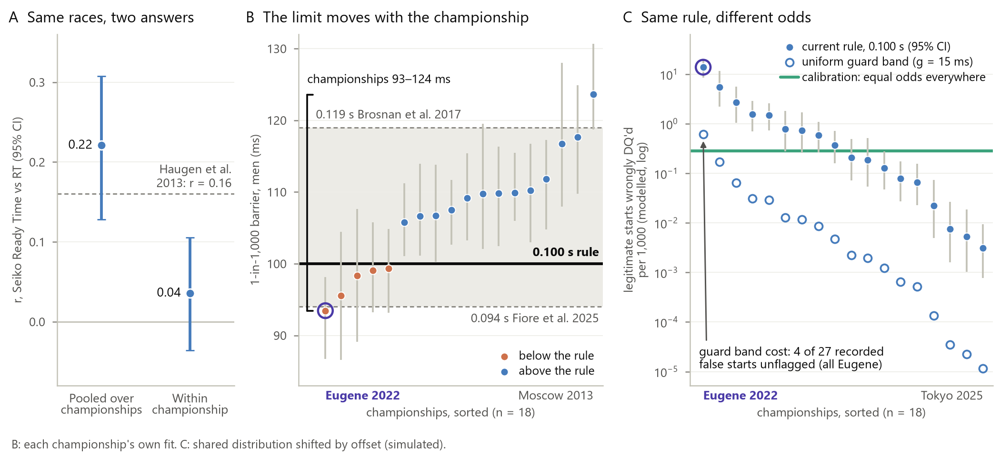

<!--
SSAC27 abstract template (Other Sports track). Render: python paper/render.py --final
Every measured number is a {{placeholder}} resolved from analysis/numbers.json; literals are design constants only
(render.py ALLOWED_LITERALS). Each qualitative claim is pinned by an assert next to it.
Data note: numbers regenerated after the false-start classifier fix (notes/bugfix_rerun_diff.md); no verdict changed.
Wording rules: "championship-level" (not "athlete-independent"); cause unidentified; never "Haugen was wrong";
"both in the last four years" is a fact, no trend is claimed (trend.h6_verdict = persisting, not worsening).
-->
<!-- note: Figure 1 = analysis/figures/confound.png (make_figures.py --fig confound) -->

# Same Rule, Different Odds: When the Start System, Not the Sprinter, Crosses the 0.100 s Line

## Introduction

One reaction time (RT) under 0.100 s disqualifies a sprinter, as it did Devon Allen at the Eugene Worlds. The rule assumes RT is comparable across championships, as do human-limit estimates (0.094 s, Fiore et al., 2025; 0.119 s, Brosnan et al., 2017) and conflicting RT effects, from starter holds (Haugen et al., 2013; r = 0.16) to rule changes (Han et al., 2025). Milloz et al. (2021) suspected start systems; this study tests whether championship-level variation manufactures such findings.

## Methods

Data comprise {{descriptive.n_valid|,d}} official RTs from public results of {{descriptive.n_comp_years}} global championships ({{descriptive.year_min}}-{{descriptive.year_max}}), with force traces and Seiko hold records ("Ready Time") for {{fp_models.n_races}} races. Mixed models with crossed athlete and race effects estimated championship offsets; Ready Time, found to start {{calibration.offset_mean_s|.2f}} s after "set", was regression-calibrated against blind broadcast-audio annotation. Pre-registered tests re-analysed the data as published designs would, simulated them, fitted per-championship RT barriers, re-ran Fiore et al.'s model, tested a WADA-style guard band, and audited {{audit.n_studies}} published studies. Code regenerates every number.

## Results

<!-- assert: [descriptive.meet_effect_range_ms] > (119 - 94) -->
<!-- assert: [descriptive.meet_effect_range_ms@fastest] == 'WCH2022' and [descriptive.meet_effect_range_ms@slowest] == 'WCH2025' -->
<!-- assert: int([descriptive.meet_effect_range_ms@fastest][-4:]) >= [descriptive.year_max] - 3 and int([descriptive.meet_effect_range_ms@slowest][-4:]) >= [descriptive.year_max] - 3 -->
<!-- assert: [calibration.offset_mean_s] > 0 -->
Offsets spanned {{descriptive.meet_effect_range_ms|.0f}} ms ({{descriptive.share_compyear_total|pct|.0f}}% of RT variance), exceeding the gap between proposed limits.
<!-- assert: [systematic.h1c_reaches_haugen] == true and [systematic.h1c_centred_below_haugen] == true and [systematic.h1_verdict] == 'SUPPORTS the mechanism' -->
Pooled across championships, as in published designs, the hold–RT correlation was r = {{systematic.h1c_r_pooled|.2f}}; within championships, where offsets cancel, {{systematic.h1c_r_centred|.2f}} (95% CI {{systematic.h1c_r_centred@lo|.2f}} to {{systematic.h1c_r_centred@hi|.2f}}). A reconstructed Haugen design with no hold effect reached |r| ≥ 0.16 in {{systematic.h1s3_cell5_p_absge016|pct|.0f}}% of simulations.
<!-- assert: [audit.k_vulnerable_studies] > [audit.n_studies] / 2 -->
Of {{audit.n_studies}} audited studies, {{audit.k_vulnerable_studies}} relied on designs exposed to championship variation, including Lipps et al.'s (2011) sex-specific limits from Beijing.
<!-- assert: [systematic.h2_verdict] == 'CONSEQUENTIAL' and [systematic.h5_verdict_venue] == "VENUE MATERIAL WITHIN FIORE ET AL.'S MODEL" -->
<!-- assert: [systematic.h2_champ_barrier_range_ms_exgauss_M@min_champ] == 'WCH2022' -->
<!-- assert: [systematic.h2_champ_barrier_range_ms_slognorm_M] > 25 and [systematic.h2_champ_barrier_range_ms_swald_M] > 25 and [systematic.h2_champ_barrier_range_ms_exgauss_M] > 25 -->
Human-limit estimates spanned {{systematic.h2_champ_barrier_range_ms_exgauss_M@min_ms|.0f}} to {{systematic.h2_champ_barrier_range_ms_exgauss_M@max_ms|.0f}} ms across championships, under all distributions; venue moved Fiore et al.'s estimate {{systematic.h5_years_barrier_range_ms|.0f}} ms.
<!-- assert: [detector.detector_median_range_ms] == 0 and [detector.force_onset_median_range_ms] > 0.5 * [descriptive.meet_effect_range_ms] -->
<!-- assert: [probe.wch2022_faster_rounds] == [probe.wch2022_faster_rounds@n_rounds] and [probe.wch2022_faster_start_types] == [probe.wch2022_faster_start_types@n_start_types] and [probe.wch2022_days_faster_than_every_2023_day] == [probe.wch2022_days_faster_than_every_2023_day@n_days] -->
<!-- assert: [probe.wch2025_straight_lane_gradient_ms_per_lane@lo] > 0 and [probe.wch2025_straight_lane_gradient_ms_per_lane@n_days] == 4 and [descriptive.meet_effect_range_ms@slowest] == 'WCH2025' -->
Force traces place offsets before detection. The same {{probe.same_athletes_2022_to_2023_change_ms@n_athletes}} athletes ran {{probe.same_athletes_2022_to_2023_change_ms|.0f}} ms faster at Eugene than a year later, and exploratory checks placed the slowest offset at one start line over four days, rising {{probe.wch2025_straight_lane_gradient_ms_per_lane|.1f}} ms per lane; cause unidentified.
<!-- assert: [trend.h6_fs_near_top_champ_count] == [trend.h6_fs_near_total] and [descriptive.meet_effect_range_ms@fastest] == 'WCH2022' -->
<!-- assert: [guard.b_p1_n_unflagged] == [descriptive.fs_near_threshold_090_100] and [guard.a_p2_fold_max_median] == 1.0 and [guard.a_p1_fold_max_median] > [guard.a_p0_fold_max_median] -->
Modelled odds of legitimate starts breaking 0.100 s varied {{fairness.meet_iqr_fold_change|.0f}}-fold across the middle half of championships; all {{trend.h6_fs_near_total|word}} recorded false starts at 0.090-0.100 s came at Eugene. A WADA-style {{guard.g_ms|.0f}} ms guard band would cut the worst odds {{guard.a_p1_cut_max|.0f}}-fold but reverse those {{guard.b_p1_n_unflagged|word}}; only per-championship calibration equalised them.

## Conclusion

<!-- assert: int([descriptive.meet_effect_range_ms@fastest][-4:]) >= [descriptive.year_max] - 3 and int([descriptive.meet_effect_range_ms@slowest][-4:]) >= [descriptive.year_max] - 3 -->
Championship-level variation in start timing can manufacture sprint reaction-time findings and move the human limit. The fastest and slowest championships since {{descriptive.year_min}} were both in the last four years. Yet World Athletics certifies its finish clock to 0.001 s while publishing no tolerance for the start measurement that disqualifies. It should test signal arrival and loudness at every block, calibrate each championship's line, and guard-band the rule meanwhile.

**Figure 1.** (A) Pooled vs within. (B) Limits by championship. (C) Odds by championship.
